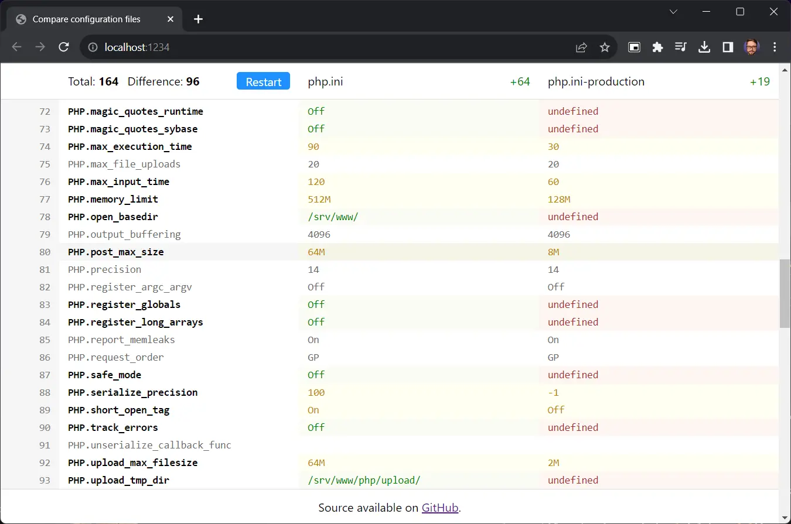

# cfgcmp

> Compare configuration files.



## About

Simple text diffing tools are not very good at comparing configuration values. If the configuration keys are in a different order, values are written in a different way, or if commentary doesn't match it will show a lot of noise.

**cfgcmp** is a web application that diffs in a structured way, suited for configurations. It'll strip comments and whitespace, sort keys and normalize values before comparing them.

It all happens on the client, so no remote calls are made.

## Roadmap

- [ ] Summary with total number of differences.
- [ ] Option to only show mismatching keys.
- [ ] Support for more file formats, like JSON and YAML.

## Development

It's a static SPA built with React and Parcel.

```
npm start
```

## Legal

Apache-2.0 ©️ 2024 Arthur Corenzan.
